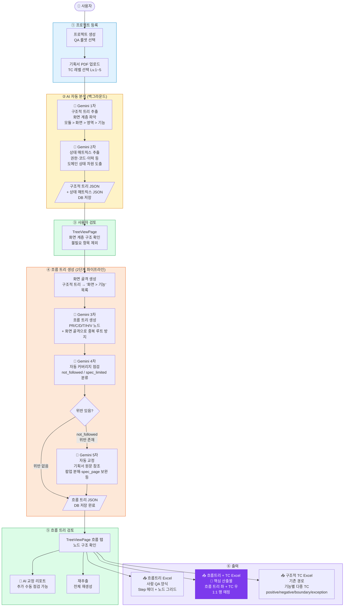
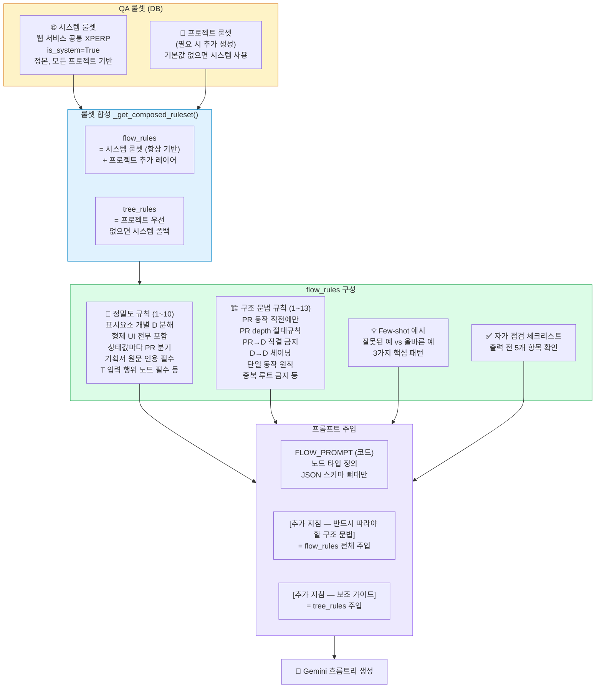
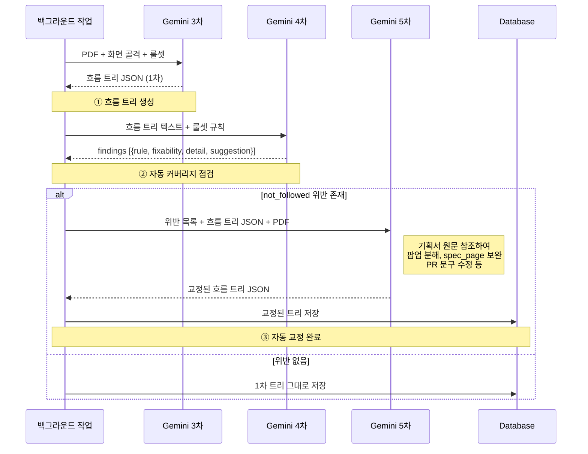
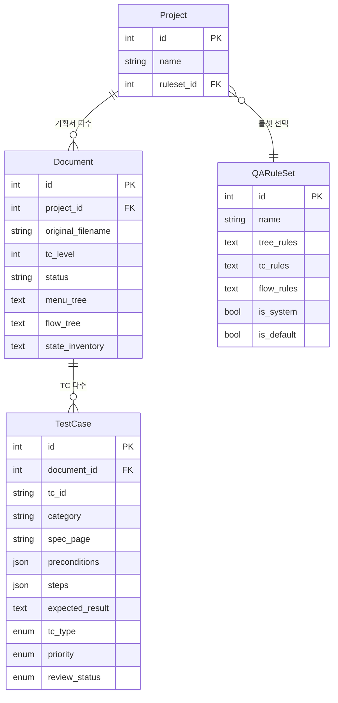
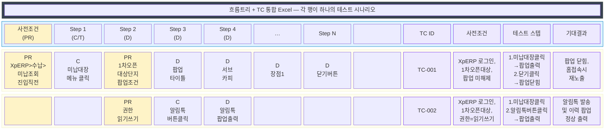

# Aegis QA Assistant — 시스템 동작 다이어그램

> Mermaid 다이어그램 (VS Code에서 Markdown Preview로 렌더링 가능)

---

## 1. 전체 시스템 플로우

---

## 2. 흐름트리 + TC Excel 생성 상세

```mermaid
flowchart LR
    A["흐름트리 JSON\n(DB 저장된 트리)"] --> B

    subgraph RENDER["1단계: 흐름 트리 렌더링"]
        B["render_flow_tree_excel()\n사람 QA 양식으로 변환"]
        B --> B1["각 행 렌더링\nPR·C·D 노드를\n열(Step) 방향으로 펼침"]
        B1 --> B2[/"path_tracker 수집\nrow번호 → 노드경로 누적\n{4:[PR,C,PR,D,D,D...],\n 5:[PR,C,PR,C,D],\n ...77:[PR,V,D]}"/]
    end

    subgraph GENERATE["2단계: Gemini 자연어 TC 생성"]
        B2 --> C1["경로 30개씩 배치 분할\n77행 → 3배치\n600행 → 20배치"]
        C1 --> C2["🤖 Gemini 호출 (배치당 1회)\n경로 텍스트 전달\nFLOW_TC_ENRICH_PROMPT"]
        C2 --> C3[/"자연어 TC 반환\n{'tcs':[{row:4, title:...,\npreconditions:...,\nsteps:...,\nexpected_result:...}]}"/]
        C3 --> C4{배치 실패?}
        C4 -- "실패" --> C5["해당 배치 스킵\n기계적 선형화로 폴백"]
        C4 -- "성공" --> C6["row번호로 TC 매핑"]
        C5 --> C6
        C6 --> C1
    end

    subgraph WRITE["3단계: 통합 Excel 생성"]
        C6 --> D1["render_flow_tree_excel\n(include_tc=True, tc_data=...)"]
        D1 --> D2["흐름트리 (B~AT열)\nStep 헤더 + PR/C/D 노드\n타입별 배경색"]
        D1 --> D3["TC (AW열~)\nTC ID / 사전조건 / 테스트스텝\n기대결과 / 기획서페이지"]
        D2 --> E["최종 Excel .xlsx\n각 행 = 흐름트리 경로 + TC 1건\n완전한 1:1 대응"]
        D3 --> E
    end

    style RENDER fill:#fef3c7,stroke:#d97706
    style GENERATE fill:#fde8d8,stroke:#ea580c
    style WRITE fill:#ede9fe,stroke:#7c3aed
    style E fill:#7c3aed,color:#fff
```

---

## 3. QA 룰셋 구조 및 적용 흐름

---

## 4. 자동 교정 루프 상세

---

## 5. 데이터 모델 관계

---

## 6. 최종 Excel 출력물 구조

---

## 렌더링 방법

### VS Code에서 확인
1. 이 파일(.md) 열기
2. `Ctrl+Shift+V` (Markdown Preview 열기)
3. Mermaid 확장 설치 필요: `Markdown Preview Mermaid Support` (shd101wyy)

### 온라인 확인
- [Mermaid Live Editor](https://mermaid.live) — 각 코드블록 내용 붙여넣기

### 이미지 변환
- VS Code: `Markdown PDF` 확장으로 PDF/PNG 변환
- CLI: `mmdc -i system_flow_diagram.md -o output.png`
